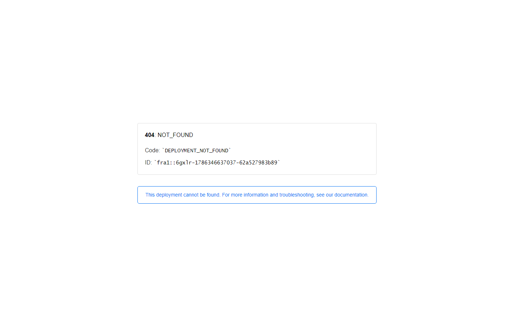
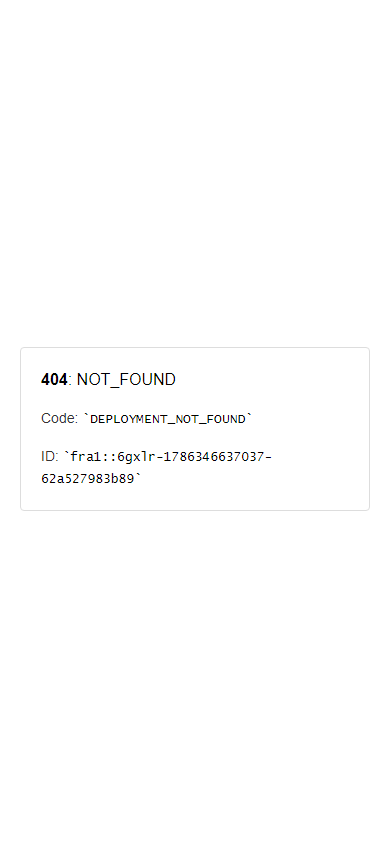

# Borza Financial Academy & Trading Simulator

A financial literacy platform and market simulator built with Next.js 16, FastAPI, SQLAlchemy, PostgreSQL, and TradingView Lightweight Charts, featuring interactive curriculum modules and classroom tools.



## Overview

**Borza Financial Academy** is an educational platform designed to teach financial literacy, investing fundamentals, and risk management through interactive coursework and market simulation.

The platform pairs a Next.js 16 frontend with an asynchronous Python FastAPI backend. Learners engage with spaced-repetition lessons using the FSRS algorithm, KaTeX-rendered financial mathematics, dynamic quiz checkpoints, and an integrated paper trading sandbox utilizing Lightweight Charts for market visualization.

## Features

- **Interactive Micro-Learning Modules**: Lessons covering personal budgeting, compound interest, stock markets, and portfolio diversification.
- **Spaced Repetition & Flashcards**: Uses the Free Spaced Repetition Scheduler (FSRS) algorithm to optimize concept retention.
- **Paper Trading Simulator**: Execute virtual market and limit orders with simulated cash balances, portfolio allocation charts, and P&L tracking.
- **Classroom & Mentor Mode**: Facilitates instructor-led cohorts with session join codes, synchronized curriculum milestones, and student competency tracking.
- **Mathematical Formula Rendering**: Native KaTeX support for rendering compound interest, annuity, and valuation formulas.
- **Dual-Database Support**: Operates locally on SQLite for zero-config evaluation or PostgreSQL 16 with Alembic migrations.
- **Containerized Orchestration**: Docker Compose configuration (`docker-compose.yml`) and developer `Makefile` for local setup.

## Screenshots

| Desktop Academy & Simulator | Mobile Responsive Interface |
|:---:|:---:|
|  |  |

## Tech Stack

### Frontend (`/frontend`)
- **Framework**: Next.js 16 (App Router, Server Components), React 19, TypeScript
- **Styling & UI**: Tailwind CSS, Lucide React, KaTeX (`katex`)
- **Data & Charts**: TanStack Query (`@tanstack/react-query`), Lightweight Charts (`lightweight-charts`)
- **Algorithms & Validation**: Free Spaced Repetition Scheduler (`ts-fsrs`), Zod
- **Testing**: Vitest, Playwright, Prettier, ESLint

### Backend (`/backend`)
- **Framework**: Python 3.13 / FastAPI, Uvicorn
- **ORM & Database**: SQLAlchemy 2.0, Alembic, Psycopg 3, PostgreSQL 16 / SQLite
- **Configuration & Security**: Pydantic Settings, HTTPX, Rate Limiting Middleware
- **Testing & Quality**: Pytest, Pytest-Cov, Ruff, Mypy

## Project Structure

```text
Borza/
├── backend/                    # FastAPI REST API application
│   ├── alembic/                # Database schema migration scripts
│   ├── app/                    # API endpoints, models, schemas, and services
│   ├── Dockerfile              # Backend container definition
│   ├── pyproject.toml          # Python tool configurations (Ruff, Mypy, Pytest)
│   └── requirements.txt        # Production Python dependencies
├── content/                    # Structured learning curriculum and module JSONs
├── docs/                       # Architecture specifications and UI screenshots
│   └── screenshots/            # Desktop and mobile application captures
├── frontend/                   # Next.js web application
│   ├── app/                    # Next.js App Router routes and pages
│   ├── components/             # React UI components and interactive charts
│   ├── config/                 # API clients and environment bindings
│   └── package.json            # Frontend dependencies and npm scripts
├── docker-compose.yml          # Multi-container orchestration (Postgres, Backend, Frontend)
├── Makefile                    # Unified developer task runner
└── render.yaml                 # Deployment blueprint configuration
```

## Installation & Setup

### Option 1: Quickstart with Docker Compose (Recommended)

```bash
# Clone the repository
git clone https://github.com/flegardev/Borza.git
cd Borza

# Configure environment variables
cp .env.example .env

# Start all services (PostgreSQL, FastAPI Backend, Next.js Frontend)
docker compose up --build
```

- **Frontend Application**: [http://localhost:3000](http://localhost:3000)
- **FastAPI OpenAPI Docs**: [http://localhost:8000/docs](http://localhost:8000/docs)

---

### Option 2: Local Development Setup

#### 1. Backend Setup (FastAPI)

```bash
cd backend

# Create virtual environment
python -m venv .venv
# Windows:
.venv\Scripts\Activate.ps1
# Linux/macOS:
source .venv/bin/activate

# Install dependencies
pip install -r requirements-dev.txt

# Run migrations (creates SQLite database by default)
alembic upgrade head

# Start API server
uvicorn app.main:app --reload --port 8000
```

#### 2. Frontend Setup (Next.js)

```bash
cd frontend

# Install Node dependencies
npm install

# Start Next.js development server
npm run dev
```

## Configuration

Configure environment variables in `.env`:

```env
APP_NAME=Borza Academy
ENVIRONMENT=development
BACKEND_HOST=0.0.0.0
BACKEND_PORT=8000

# Database Configuration (SQLite default; use postgresql:// for Postgres)
DATABASE_URL=sqlite:///./borza_academy.db
POSTGRES_PASSWORD=your_secure_postgres_password

# Rate Limiting & Security
RATE_LIMIT_REQUESTS_PER_MINUTE=240
RATE_LIMIT_SENSITIVE_PER_MINUTE=30
MAX_REQUEST_BODY_BYTES=262144
FRONTEND_URL=http://localhost:3000
CORS_ORIGINS=http://localhost:3000,http://127.0.0.1:3000
ALLOWED_HOSTS=localhost,127.0.0.1
```

## Testing & Quality Assurance

Using the root `Makefile`:

```bash
# Run backend and frontend unit test suites
make test

# Run code style and lint checks
make lint

# Run static type checks (Mypy & TypeScript)
make typecheck

# Execute integration tests with PostgreSQL in Docker
make test-integration
```

## License & Portfolio Notice

Copyright (c) 2026 Tini Flegar. All rights reserved.
Published for portfolio review and technical demonstration.
